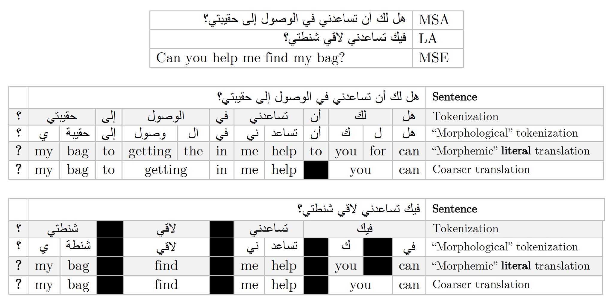

# Bootstrapping a POS Tagger

In this assignment, I tackle part-of-speech (POS) transfer from Modern Standard Arabic (MSA) to Lebanese Arabic (LA) which is one of numerous dialects spoken by people (approx. 380M) in the Arab world. Dialectal Arabic (DA) is very interesting in that not only does it differ substantially from MSA in terms of phonology, morphology, lexical choice, and syntax, but most importantly, it is the true native language of each population which speaks it as MSA is just written and generally not spoken.

One issue which computational linguists aspiring to work with such dialects must face is that there is no standard orthography which is agreed upon for writing in any of the DA varieties. For example, there is unfortunately no standard way of writing in LA as it has roots in Aramaic and many borrowings from Syriac-Aramaic which makes its structure a bit different from MSA, and hence, this really affects the way LA words are written. Due to the highly synthetic nature of Arabic in general, the way the inflections are expressed in LA vary substantially, and there is no standard, widely used way of writing them until this day. So, in the same corpus, you are likely to find two exact same structures of words (and often
more) written in different ways.

To describe the alignment task, I have arranged three tables, which show a sample sentence. Note that Arabic is written and read from right to left.

  

For bootstrapping, POS projections from the source langauge to the target language are made and then smoothed. This results in training data for the target language, which can then be used to train a neural tagger such as UDPipe (or any other type of tagger). The original treebank files have not been added for copyright issues.

This project is still ongoing. For more detail, see this [link](https://drive.google.com/open?id=13nZc0RbOss4Qh-y8uzIncJOI4xtlOZYN).