# Language Modeling
The following analysis aims at quantifying the entropy of a corpus based on the language of the latter. A couple of experiments outlined below are performed to study the way the entropy of the cropora changes when they are altered, and the way smoothing a language model affects entropy.
## Conditional Entropy

In this experiment, the conditional entropy of two corpora (Czech and English) is studied, after variably altering them. Conditional entropy is calculated as shown below:

  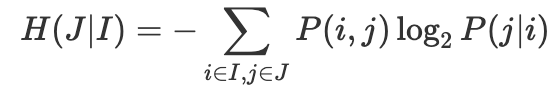

Following are the results of the conditional entropy calculations performed in `conditional_entropy.py`, averaged over 10 different messup likelihoods (probability of randomly altering a word/character in the dataset). The first table corresponds to entropy values while the second shows perplexity values.

  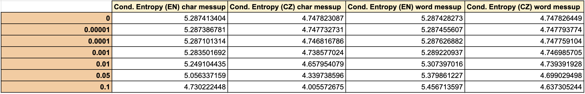

  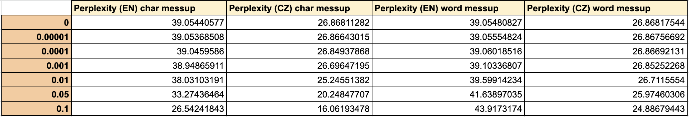

		  
Below are graphs of the above tabulated results:

  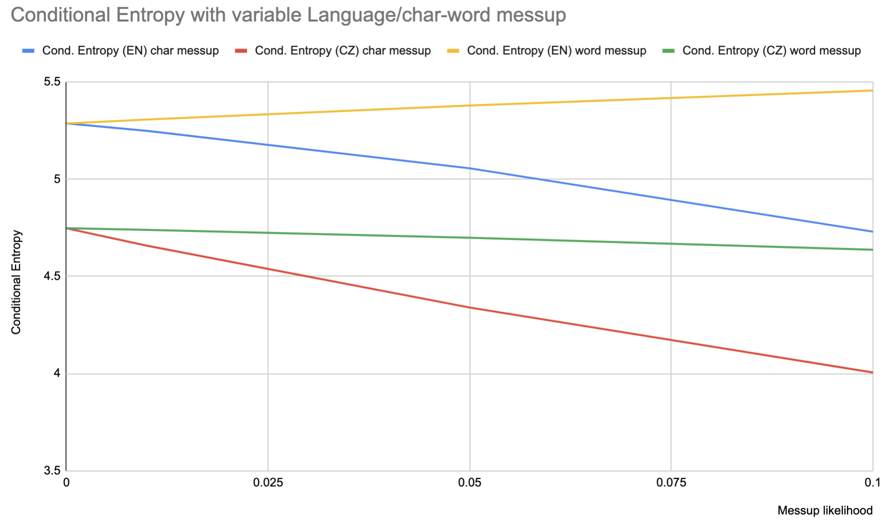

  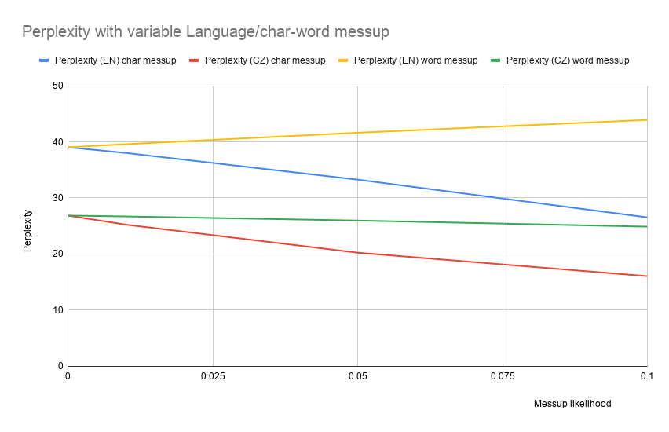

Also, find below some basic information about each file generated by the above source code:

  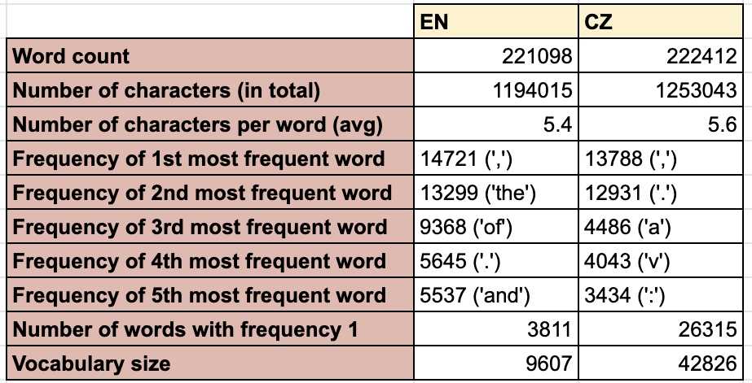

### Comments
		
Conditional entropy in our context quantifies how well one can predict a given token, given the previous token. Low conditional entropy means the previous token in question is a good predictor of the current token. Both corpuses (Czech and English) have a similar amount of tokens, characters, number of characters per token and most frequent tokens, so these aren't really useful for our analysis. Also, conditional entropy for Czech in this corpus is lower than that of English and this is probably due to the morphosyntax of Czech. Czech is much more morphologically rich than English, and hence, each word can take on a multitude of forms based on its declension. This is also why we see a greater number of tokens with frequency 1 in Czech. The more a language is morphologically rich, the less there is uncertainty as to what a word will turn out to be given the previous word, hence, resulting in a lower conditional entropy.

As for the reason why conditional entropy decreases when characters and words are messed up, we can say the following. If a token's characters are messed up, we will obtain more bigrams with conditional probability equal to 1.0 and thus a log2 factor of zero. Hence, conditional entropy decreases. Now, if words are messed up as an integral unit, two different things happen depending on whether the language is Czech or English. In the former it decreases (just like for character messup), and in the latter it increases. We know that word order in English matters much more than word order in Czech, by virtue of Czech's morphosyntactical richness in comparison to English. Hence, changing whole words in English would result in a much more random text, which will most likely be much more irregular in its structure. Changing the words in Czech has less of a chance to result in an incorrect structure than in English, and will retain more of its structure, and thus, the information one word can give about the next one.

Also, note that average slopes for character messup are more steep than those of word messup. This is reasonably explained by the fact that introducing new words will result in many more occurences of zero log2 factors.

		
		
### Quick Fact:
What happens when we calculate the entropy of a concatenation of two corpora which have the same entropy but do not share any vocabulary items?

Assume that we have a corpus T1 in language L1 and corpus T2 in language L2. If we append T2 to the end of T1, then the following will happen. The amount of tokens will increase by some factor. All joint probabilities P(i, j) will decrease by that same factor as a result of that, while conditional probability distributions P(j|i) will not change. But since T2 has the same entropy as T1, then all probabilities of T2 will compensate exactly for that decrease, so that the sum of both will bring us back to our initial amount of entropy. Two things should be noted. The token which contains the blank word in the beginning of T2 will not be present in the newly formed text, but this does not make any difference because its conditional probability was 1.0 and resulted in 0 because of the log2 factor. However, there will be a new token neither seen in T1 or in T2, that is a token which contains one word of each. This token will make the difference, and will cause an increase in entropy for the newly formed text.

## Language Model Smoothing and Cross Entropy

This experiment aims at showing the importance of smoothing for language modeling. Following are the results of the cross entropy calculations performed in the above source code for English and Czech with varying lambda parameters. Note that L0 + L1 + L2+ L3 = 1 always. The `cross_entropy.py` file contains an implementation of the following smoothed trigram model using interpolation:

  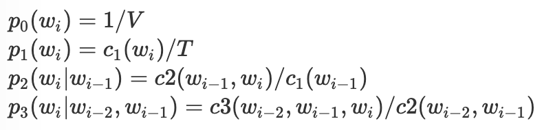

  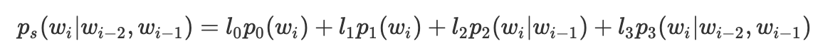

  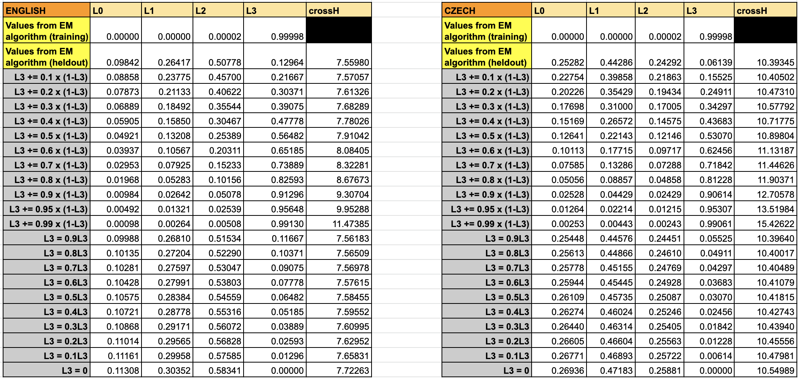

Below is a histogram tabulation of the above data.

  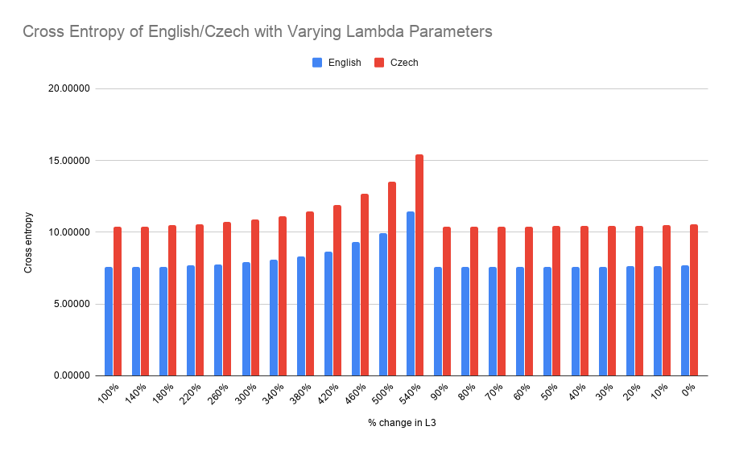

### Comments:

First of all, note the difference between using the heldout data and using the training data to calculate the lambda parameters in the above table. Using the training dataset to calculate them will always cause the L3 (trigram) parameter to be very close to 1.0. This is because the individual trigram, bigram, and unigram distributions have been trained using the training data in the first place, so if we feed it again data from its own source (training data), all trigrams will match and we will have no need for either bigram, or unigram probabilities to calculate the smoothed distribution.

We can see that for English, most of the weight is on the bigram parameter, followed by the unigram parameter. In Czech it's the opposite, and this makes sense since in reference to the table in the first experiment which gives information about the two corpuses, we notice that the number of words with frequency 1.0 is much more pronounced for Czech, and this would probably play a role in making the Expectation Maximization (EM) algorithm produce a higher weight for L1.

As we can see in the below table, 95.6% and 86.5% of the words in the English and Czech test sets respectively are present in their respective training sets. This explains why we observe a lower cross entropy for English as opposed to Czech because if we do not see a word, then there is no probability assignment from any of the trigram, bigram, or unigram distributions.

  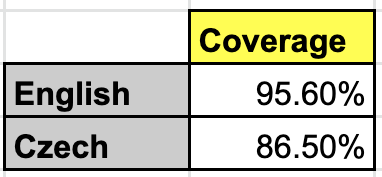

As is apparent from the above graph, we see that increasing L3 affects the cross entropy in a bad way (makes it increase rapidly) and cross entropy can be seen as a measure of the accuracy of the model. Hence the former increase can be explained by the fact that locating an exact trigram is much less likely than locating either a bigram or a unigram in the trigram, bigram, and unigram distributions. Hence, giving more weight to the trigram parameter will affect cross entropy negatively. Now, decreasing L3 also makes the cross entropy increase, but not as drastically as decreasing it does. This is because we do rely sometimes on the trigram distribution, and decreasing it too much will make a small yet noticeable difference.
