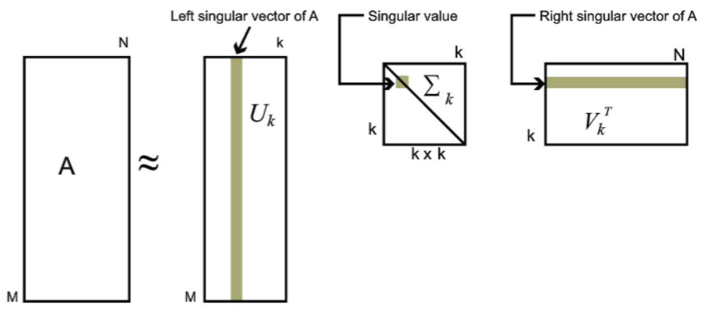

# Text Summarization

Text summarization module which performs LSA to produce sentences extracted from the text which represent it the most. LSA uses Singular Value Decomposition (SVD), and then uses the VT matrix produced by SVD (the columns of which represent the sentences) to extract sentences from the text.

  

"Consider the words *car*, *automobile*, *driver*, and *elephant*. The terms *car* and *automobile* are synonyms, *driver* is a related concept and *elephant* is unrelated. In most retrieval systems, the query automobiles is no more likely to retrieve documents about cars than documents about elephants, if neither used precisely the term *automobile* in the documents. It would be preferable if a query about automobiles also retrieved articles about cars and even articles about drivers to a lesser extent. The derived k-dimensional feature space can represent these useful term inter-relationships. Roughly speaking, the words *car* and *automobile* will occur with many of the same words (e.g. motor, model, vehicle, chassis, carmakers, sedan, engine, etc.), and they will have similar representations in k-space. The contexts for *driver* will overlap to a lesser extent, and those for *elephant* will be quite dissimilar. The main idea in LSI is to explicitly model the interrelationships among terms (using the truncated
SVD) and to exploit this to improve retrieval." [1]

Note: Code is based on [4] which is in turn based on [2].

## Usage

- If you want to analyze your own document:

    `python3 lsa.py -i <input-file>`

- If you just want to test the module using an existing g3.Analysis file (an example g3.Analysis object is present in this repository called `analysis.json`):
    
    `python3 lsa.py -t <analysis.json>`

- Any of the following flags can be used:
  - `-eval`, `--evaluation`: Path of the reference file to compare against (computes the Rouge1 score); evaluation requires the `sumeval` package.
  - `-s`, `--save`: If an analysis on an input file was performed, saves it in the specified output file's name for future use. To use in conjunction with `-i`.
  - `-n`: Number of sentences used in the summary.
  - `-c`, `--cell-type`: Type of values to be used for the cells of the A matrix; current options: *tf* or *tfidf*.
  - `-lang`, `--language`: Language of the article (no format, just the name of the language).
  - `-l`, `--length`: Length of sentences to consider for the A matrix; format: *min_length,max_length*.
  - `-e`, `--entity`: Entities will be included in the computation of the A matrix.
  - `-rel`, `--relations`: Relations will be included in the computation of the A matrix. Only supported in Czech and English.
  - `-p`, `--print`: Print the chosen sentences to the default output stream.

## TODO

- The `-e` mode is yielding bad results
  - Find a way to include entities into the features without adding redundancy (not just concatenation) ✅
  - Could potentially include user defined weights which will decide what kind of entities to focus on the most (person, location, etc.) for the summary, and this can be implemented by incorporating those weights into the sentence score.

- Change the way the score of a sentence if calculated based on the Cross Method from [3] ✅
- Perform testing using some dataset and the ROUGE score [5] ✅

- Could use relations features (e.g., verbs are generally packed with the most information for a summary, so increase their weight manually in the tf-idf matrix) ✅

- If some structure of the document is available, give more weight to first and last sentence of each paragraph.

- Include a co-reference resolution module which could replace pronouns by their correct object after sentences are extracted, so that the summary will appear more fluid.

- Could take POS into account (e.g., if token is root then, add more weight)

## References

[1]M. Berry, S. Dumais and G. O’Brien, "Using Linear Algebra for Intelligent Information Retrieval", SIAM Review, vol. 37, no. 4, pp. 573-595, 1995.

[2]J. Steinberger and K. Ježek, "Using Latent Semantic Analysis in Text Summarization and Summary Evaluation", 2004. Available: http://www.kiv.zcu.cz/~jstein/publikace/isim2004.pdf.

[3]M. Ozsoy, I. Cicekli and F. Alpaslan, "Text Summarization of Turkish Texts using Latent Semantic Analysis", 2010. Available: https://www.aclweb.org/anthology/C10-1098.pdf. [Accessed 22 September 2020].

[4]"iamprem/summarizer", GitHub, 2020. [Online]. Available: https://github.com/iamprem/summarizer.

[5]"What is ROUGE and how it works for evaluation of summarization tasks? | RxNLP", Practical Tools for NLP and Text Mining. [Online]. Available: https://rxnlp.com/how-rouge-works-for-evaluation-of-summarization-tasks/#.X2sBzZMzYbk.

[6]"awesome-text-summarization", GitHub, 2020. [Online]. Available: https://github.com/mathsyouth/awesome-text-summarization.